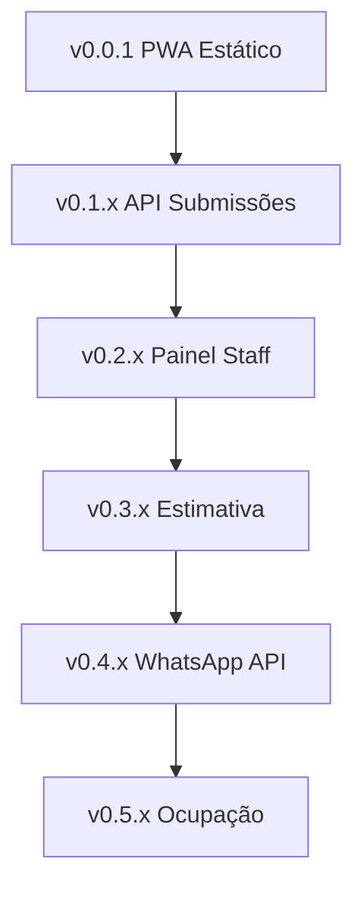

	<h1>🐾 Social Pet – PWA Pré-Atendimento (v0.0.1)</h1>
	
Aplicação estática (GitHub Pages) + PWA offline para coleta de dados antes da negociação via WhatsApp.

	Versão 0.0.1 – Escopo enxuto: somente front. Backend removido para simplificar.

## ✅ Objetivo
Evitar retrabalho e troca de mensagens repetitivas: o tutor preenche tudo, gera uma mensagem consolidada e abre direto o WhatsApp da equipe para negociação de valores e confirmação.

## 🧱 Stack (v0.0.1)
- HTML + Bootstrap 5 (CDN)
- Vanilla JavaScript modular (`assets/js/app.js`)
- PWA (Service Worker + Manifest + Offline Cache)
- `localStorage` (persistência local + export/import JSON)
- Deploy: GitHub Pages (100% estático)

## 🗂️ Arquivos
| Arquivo | Descrição |
|---------|-----------|
| `index.html` | Estrutura principal + wizard multi-etapas + inclusão scripts. |
| `assets/css/custom.css` | Estilos complementares e animações. |
| `assets/js/app.js` | Lógica de estado, validação, geração de mensagem, PWA & tema. |
| `manifest.webmanifest` | Manifesto PWA. |
| `sw.js` | Service Worker (cache offline). |
| `version.txt` | Versão exibida no badge. |
| `LICENSE` | Licença do projeto. |

## ✨ Funcionalidades v0.0.1
- Wizard 4 etapas: Tutor → Pets → Serviços/Estadia → Termos & Mensagem
- Mensagem WhatsApp consolidada (sem valores)
- Regras de negócios (horários, dias úteis, check-in/out ≤ 18h, campos obrigatórios)
- Múltiplos pets com vacinas, saúde, comportamento
- PWA: instalação + offline (cache básico)
- Exportar / Importar dados (`JSON`)
- Tema claro/escuro persistente
- Badge de versão dinâmico
- LGPD (consentimento simples, dados só localmente)

## 🛡️ LGPD (v0.0.1)
Nenhum dado sai do dispositivo. Próximas versões: aviso de privacidade dedicado, política de retenção e botão "Excluir meus dados" mais explícito.

## 🚀 Deploy no GitHub Pages
1. Commit `index.html` na branch `main`
2. Ativar Pages: Settings → Pages → Deploy from branch → `main` / root
3. Acessar URL pública gerada

## 🧪 Próximos Incrementos (Rascunho)
| Fase | Foco |
|------|------|
| 0.0.x | Ajustes UI/UX, acessibilidade, limpeza de código |
| 0.1.0 | Backend API submissões + persistência |
| 0.2.0 | Painel interno staff + autenticação básica |
| 0.3.0 | Estimativa automática (sem preços externos) |
| 0.4.0 | Integração oficial WhatsApp API / disparo direto |
| 0.5.0 | Ocupação & capacidade visual |

## 🧩 Evolução Arquitetural (Futuro)
Backend só será reintroduzido quando precisarmos histórico centralizado / painel. Até lá manter simplicidade.

## 🔧 Como Testar Localmente
Basta abrir `index.html` em um navegador moderno (Chrome / Firefox / Edge / Safari). Nenhuma dependência extra.

## 🗜️ Ajustes Rápidos Possíveis
- Alterar número WhatsApp padrão em `generateWhatsAppLink()` → variável `companyNumber` dentro do script.
- Alterar janela de funcionamento → editar validação dentro de `validateBusinessRules()`.

## 📌 Convenções Futuras (quando backend entrar)
- TypeScript estrito, testes ≥80% coverage
- Commits semânticos já em uso
- Pipeline CI: lint + test + build (planejado)

## 📄 Roadmap (Épicos Sintéticos)

## 🤝 Contribuição
1. Fork / Branch
2. Commits semânticos
3. Pull Request descrevendo mudanças

## 📬 Suporte / Dúvidas
Abra uma issue descrevendo sua necessidade ou sugestão.

---
MVP gerado. Iterações bem-vindas.

---
### 🔢 Versionamento
Badge lê `version.txt` (ex: `0.0.1`). Para atualizar:
1. Editar `version.txt` (ex: `0.0.2`).
2. Commit: `chore: bump version to 0.0.2`.
3. Aguardar Pages invalidar cache (forçar reload se necessário).

Semântica:
- MAJOR: quebra contrato campos.
- MINOR: novos campos / flows.
- PATCH: ajustes UI/validação/refactor.