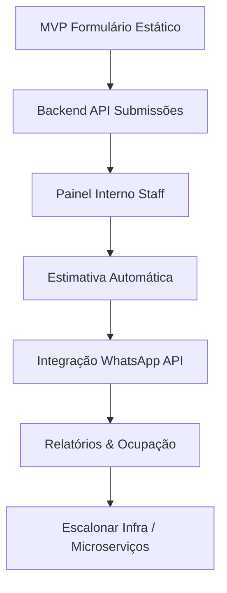

	<h1>🐾 Social Pet – MVP Pré-Atendimento</h1>
	
Formulário único (static HTML) para coleta completa de dados antes do atendimento via WhatsApp.

	Versão inicial – nenhum backend ainda. Foco: agilidade e padronização das informações.

## ✅ Objetivo
Evitar retrabalho e troca de mensagens repetitivas: o tutor preenche tudo, gera uma mensagem consolidada e abre direto o WhatsApp da equipe para negociação de valores e confirmação.

## 🧱 Stack (MVP)
- HTML + Tailwind CDN
- Vanilla JavaScript modularizado dentro do arquivo (auto-executável IIFE)
- Armazenamento local: `localStorage` (export/import JSON)
- Deploy alvo: GitHub Pages (estático)

## 🗂️ Arquivos
| Arquivo | Descrição |
|---------|-----------|
| `index.html` | Form principal + lógica de geração de mensagem WhatsApp + persistência local. |
| `version.txt` | Arquivo fonte da versão exibida como badge no app. |
| `LICENSE` | Licença do projeto. |

## ✨ Funcionalidades Principais
- Cadastro de Tutor (nome, telefone WhatsApp, email, observações)
- Múltiplos Pets (porte, raça, idade, vacinas, comportamento, saúde, restrições)
- Tipos de atendimento: Hotel, Creche (Daycare), Banho/Tosa Avulso
- Controle de estadia (datas e horários) com regras:
	- Funcionamento geral: 09:00–20:00
	- Check-in / Check-out: somente dias úteis até 18:00
- Banho durante estadia (checkout / semanal / 2x semana / nenhum)
- Serviço Avulso: Banho, Tosa, Banho+Tosa, Outro
- Tosa opcional (diversos tipos)
- Medicação / Alimentação Especial (com campo detalhado condicional)
- Cuidados Extras / Observações
- Geração de mensagem estruturada (texto pronto para colar / enviar)
- Link direto para WhatsApp (substituir número interno no código quando definido)
- Salvamento automático no `localStorage`
- Exportar / Importar JSON (portabilidade)
- Alternância de Tema (claro/escuro)
- Consentimento LGPD + Termos (aceite obrigatório)
- Validações de negócio e feedback de status

## 🛡️ LGPD (MVP)
Nenhum dado é enviado a servidor neste estágio. As informações ficam no navegador do usuário. Próximos passos futuros incluirão:
- Aviso de privacidade dedicado
- Política de retenção e exclusão
- Opção "Esquecer meus dados"

## 🚀 Deploy no GitHub Pages
1. Commit `index.html` na branch `main`
2. Ativar Pages: Settings → Pages → Deploy from branch → `main` / root
3. Acessar URL pública gerada

## 🧪 Próximos Incrementos (Planejado)
| Etapa | Descrição |
|-------|-----------|
| Persistência Backend | API mínima (NestJS + PostgreSQL) para armazenar submissões e gerar dashboard interno |
| Autenticação Staff | Login interno para equipe revisar e marcar status de agendamentos |
| Geração de Proposta | Cálculo automático de estimativa (sem exibir preço final público) |
| Integração WhatsApp API | Envio automático sem abrir cliente consumidor (depois) |
| Painel Ocupação | Visualização de capacidade (hotel / creche) |
| Auditoria & Logs | Trilhas de ações internas |
| Internacionalização | Preparar i18n (fase expansão) |

## 🧩 Evolução Arquitetural Planejada
Fase 2: Monólito backend (NestJS + TypeScript) com módulos: Auth, Tutors, Pets, Bookings, Pricing Rules, Messaging.
Fase 3: Extração de microserviços (Payment / Notifications) se volume exigir.

## 🔧 Como Testar Localmente
Basta abrir `index.html` em um navegador moderno (Chrome / Firefox / Edge / Safari). Nenhuma dependência extra.

## 🗜️ Ajustes Rápidos Possíveis
- Alterar número WhatsApp padrão em `generateWhatsAppLink()` → variável `companyNumber` dentro do script.
- Alterar janela de funcionamento → editar validação dentro de `validateBusinessRules()`.

## 📌 Convenções Futuras (quando backend iniciar)
- TypeScript estrito, ESLint + Prettier
- Testes ≥80% coverage (Jest / Supertest)
- Commits semânticos (feat:, fix:, chore:, docs:, refactor:, test:)
- GitHub Actions: build + lint + test + docker build

## 📄 Roadmap (Épicos Sintéticos)

## 🤝 Contribuição
1. Fork / Branch
2. Commits semânticos
3. Pull Request descrevendo mudanças

## 📬 Suporte / Dúvidas
Abra uma issue descrevendo sua necessidade ou sugestão.

---
MVP gerado. Iterações bem-vindas.

---
### 🔢 Versionamento da Interface
O badge de versão (ex: `v0.0.1`) é carregado do arquivo `version.txt` via fetch. Para atualizar:
1. Edite `version.txt` (ex: `0.0.2`).
2. Faça commit semântico: `chore: bump version to 0.0.2`.
3. Após o deploy/Pages recarregar, verifique o canto superior (navbar) para confirmar.

Sugestão de semântica de versão:
- MAJOR: mudanças incompatíveis na coleta de dados.
- MINOR: novos campos / features não disruptivos.
- PATCH: correções de layout, ajustes de validação, refactors internos.